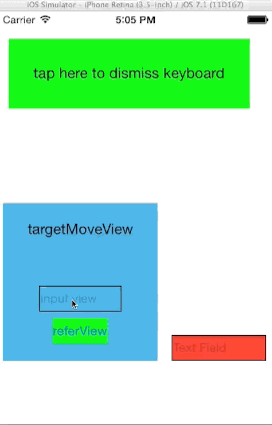

WYKeyboardObserve
=================

A Category for UIViewController that can easily manage keyboard response.

## 使用
### 1.添加observe
在`viewWillAppera`中添加如下方法

```
[self addObserveKeyboardWithAnimation:^(id controller, CGFloat targeMoveViewEndTop, CGFloat offset, NSString *const notification) {
        // your code
    }];
```

### 2. 移除observe
在 `viewWillDisappear` 中添加 `[self removeObservKeyboard];`

### 3. 在合适的时机设置targetMoveView and referView 
targetMoveView: 在键盘将要弹出或者收回时，被移动的view
referView: referView.top 会与 keyboard.top 进行对比，以决定targetMoveView是否真的需要移动


## Usage
### 1.Add Observe
add follow code in `viewWillAppear`

```
[self addObserveKeyboardWithAnimation:^(id controller, CGFloat targeMoveViewEndTop, CGFloat offset, NSString *const notification) {
        // your code
    }];

```

### 2.Remove Observe
add `[self removeObservKeyboard];` in `viewWillDisappear`

### 3.Set targetMoveView and referView 
targetMoveView: the view that view move when keyboard show or hide
referView: referView.top  will compare to the keyboard.top to determine whether targetMoveView should be moved